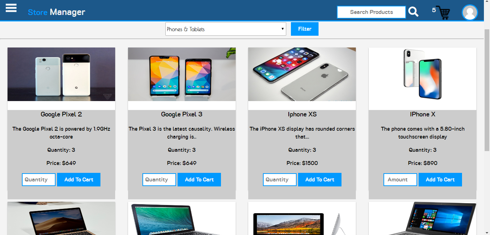

# Store Manager
A web application that helps store owners manage sales and product inventory records. Store owners/managers can create store attendant accounts who would be in charge of selling of items in the store.

 

### Table Of Contents

- <a href="#built-with">Built With</a>
- <a href="#testing-tools">Testing Tools</a>
- <a href="#getting-started">Getting Started</a>
- <a href="#license">License</a>
 
<h1>Store Manager UI Template</h1>

## Built With
<ul>
<li><a href="https://developer.mozilla.org/kab/docs/Web/HTML">HTML</a></li>
<li><a href="https://developer.mozilla.org/en-US/docs/Web/CSS">CSS</a></li>
<li><a href="https://developer.mozilla.org/bm/docs/Web/JavaScript">JAVASCRIPT</a></li>
</ul>

<h3>Link to template: <a href="https://easybuoy.github.io/storemanager/UI/index.html">Store Manager Template</a> </h3>

<h1>Store Manager API Backend</h1>

<h2>Built With</h2>
<ul>
<li><a href="https://nodejs.org/en/">Nodejs</a></li>
<li><a href="https://expressjs.com/">Expressjs</a></li>
</ul>

## Testing Tools
<ul>
<li><a href="https://mochajs.org/">Mocha</a></li>
<li><a href="https://www.chaijs.com/">Chai</a></li>
</ul>

<h3>Link to API: <a href="https://store--manager.herokuapp.com/">Store Manager API</a> </h3>

## Getting Started

<h3>Prerequisites</h3>
You need Nodejs Installed to be able to run this project on your machine.

<h3>Installing<h3>
<ul><li>Clone Repository</li></ul>
<pre><code>git clone https://github.com/Easybuoy/storemanager</code> </pre>
 
 

<ul><li>Change Directory To Store Manager</li></ul>
<pre><code>cd storemanager</code></pre>
 
 

<ul><li>Install Dependencies</li></ul>
<pre><code>npm install</code></pre>
 
 

<ul><li>Start Application</li></ul>
<pre><code>npm run start</code></pre>
 
 

<ul><li>Run Test</li></ul>
<pre><code>npm run test</code></pre>
 
 

<ul><li>Run Coverage Report</li></ul>
<pre><code>npm run coveralls</code></pre>
 

<h2>API Routes</h2>  

| DESCRIPTION                     | HTTP METHOD   | ROUTES                                        | ACCESS        |
| ---------------                 | --------------|-----------------------------------------------|---------------|
| Register User                   | POST          | /api/v1/auth/signup                           | PRIVATE       |
| Login User                      | POST          | /api/v1/auth/login                            | PUBLIC        |
| Make Store Attendant an Admin   | POST          | /api/v1/auth/makeadmin                        | PRIVATE       |
| Get Current User Details        | GET           | /api/v1/auth/current                          | PRIVATE       |
| Get All Store Attendants        | GET           | /api/v1/auth/attendants                       | PRIVATE       |
| Delete A Store Attendant        | DELETE        | /api/v1/auth/attendant/{id}                   | PRIVATE       |
| Create New Product              | POST          | /api/v1/products                              | PRIVATE       |
| Get All Products                | GET           | /api/v1/products                              | PRIVATE       |
| Get Single Product Detail       | GET           | /api/v1/products/{id}                         | PRIVATE       |
| Update Single Product Detail    | PUT           | /api/v1/products/{id}                         | PRIVATE       |
| Delete Single Product Detail    | DELETE        | /api/v1/products/{id}                         | PRIVATE       |
| Assign Product To Category      | PUT           | /api/v1/products/{id}/{categoryId}            | PRIVATE       |
| Create New Sale                 | POST          | /api/v1/sales                                 | PRIVATE       |
| Get All Sales                   | GET           | /api/v1/sales                                 | PRIVATE       |
| Get Single Sale Detail          | GET           | /api/v1/sales/{id}                            | PRIVATE       |
| Make a new Category             | POST          | /api/v1/categories/                           | PRIVATE       |
| Get All Categories              | GET           | /api/v1/categories/                           | PRIVATE       |
| Update a Category               | PUT           | /api/v1/categories/{id}                       | PRIVATE       |
| Delete a Category               | DELETE        | /api/v1/categories/{id}                       | PRIVATE       |

   

## License
<h4>This project makes use of the MIT License which can be found <a href="https://github.com/Easybuoy/storemanager/blob/develop/LICENSE">here</a></h4>